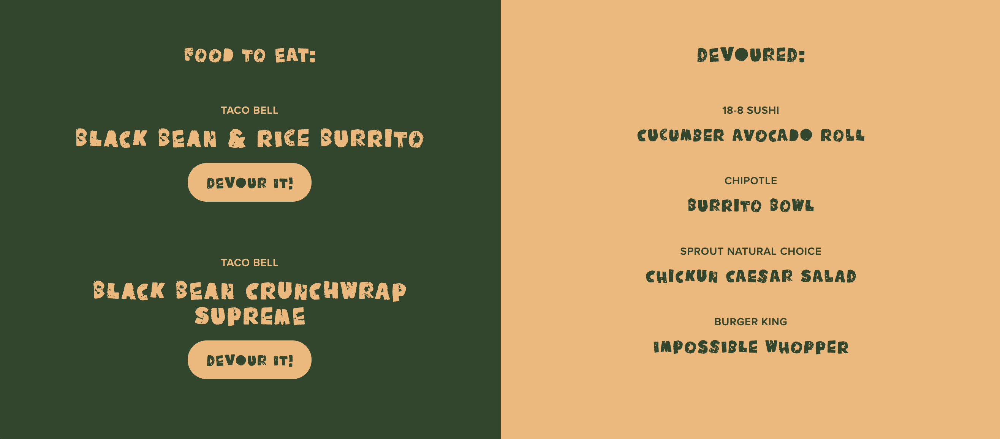

# Eat-A-Something
A simple web app for you to devour your favorite foods. Add any restaurant food item to your list of available foods to eat, and at the click of a button, devour them. All food items added by the user live in a SQL database and are sorted on the front-end by whether or not they’ve been devoured yet.

        




## Functionality
```
WHEN I visit the deployed application
THEN I can view my list of available foods to eat
WHEN I add a new food item
THEN that food item is added to the 'Food to Eat' section
WHEN I click the 'Devour It' button under a food item
THEN that food item is moved to the 'Devoured' section
WHEN I refresh the page
THEN all of my items stay where they are and nothing is impacted
```


## Table of Contents 
* [Usage](#usage)    
* [Credits](#credits) 
* [Questions](#questions) 
* [Donate](#donate)
* [License](#license) 


## Usage 
sdvfsvf

    


## Credits
This project utilizes a SQL database to store foods. 


## Questions
If you have any questions, feel free to find me at:
* Email: laurensiminski@gmail.com
* Website: https://siminski.co
* Github: [@siminski](https://github.com/siminski)


## Donate
Appreciate this code? Say thanks with a coffee:

[](https://ko-fi.com/W7W21YVJJ)


## License
Copyright (c) 2020 Lauren Siminski.